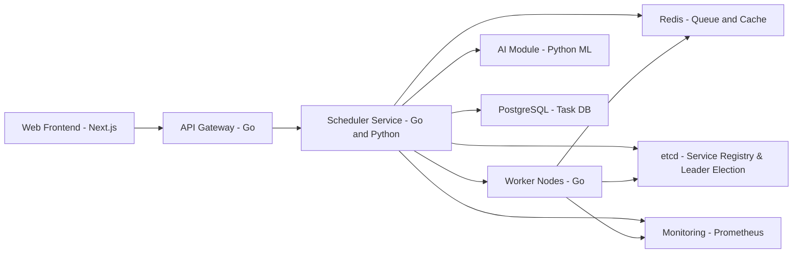

# iDTask

A simplified high-concurrency distributed task scheduler built with Go and Python, demonstrating microservices architecture, intelligent scheduling, and observability. 

## 🔧 Tech Stack

* **Go**: Core scheduler, API gateway, and workers
* **Python**: AI-based task prediction and scheduling
* **Redis**: Job queue and fast cache
* **PostgreSQL**: Task and log storage
* **Next.js + Tailwind + Shadcn/UI**: Frontend for task monitoring
* **Prometheus**: Monitoring and metrics
* **gRPC**: Inter-service communication between Go and Python services
* **etcd**: Distributed coordination and leader election
* **Docker Compose**: Local orchestration of services

## 📐 System Architecture



## 🚀 Features

* Dynamic task dispatching with Redis queue
* AI-based task prioritization (Python ML model)
* gRPC-based AI prediction integration
* Metrics tracking with Prometheus exporters
* Frontend task status view with Next.js📌 Features
* PostgreSQL storage and logging
* Leader election via etcd
* Prometheus metrics endpoint
* Delayed task queue via Redis ZSET
* RESTful APIs with CORS support
* Horizontally scalable worker model

## 🛠️ How to Run

```bash
# 1. Start Redis and Postgres (Docker recommended)
docker compose up -d

# 2. Run Go services
cd idtask-scheduler && go run api/main.go

# 3. Start Python AI module
cd ai-predict-service && python src/server.py

# 4. Run Scheduler
cd idtask-scheduler && go run scheduler/main.go

# 5. Run Worker(s)
cd idtask-scheduler && go run worker/main.go

# 6. Launch frontend
cd idtask-client && npm install && npm run dev
```

## 🚀 Performance Benchmark

Tested with [`wrk`](https://github.com/wg/wrk):

```bash
wrk -t12 -c400 -d30s -s test.lua http://localhost:8080/tasks
```

### ⚡️ Throughput

- **5660+ TPS** (tasks per second) sustained under pressure
- Equivalent to **340,000+ tasks per minute**
- End-to-end latency remains stable (~44ms average)


## 📎 License

MIT
