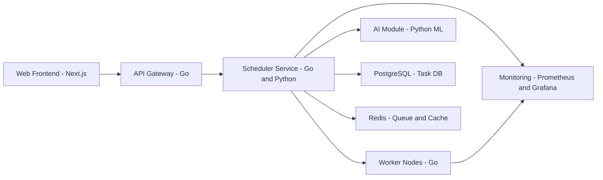

# iDTask

A simplified high-concurrency distributed task scheduler built with Go and Python, demonstrating microservices architecture, intelligent scheduling, and observability. 

## 🔧 Tech Stack

* **Go**: Core scheduler, API gateway, and workers
* **Python**: AI-based task prediction and scheduling
* **Redis**: Job queue and fast cache
* **PostgreSQL**: Task and log storage
* **Next.js + Tailwind + Shadcn/UI**: Frontend for task monitoring
* **Prometheus + Grafana**: Monitoring and metrics

## 📐 System Architecture



## 🚀 Features

* Dynamic task dispatching with Redis queue
* AI-based task prioritization (Python ML model)
* Metrics tracking with Prometheus exporters
* Frontend task status view with Next.js

## 🛠️ How to Run

```bash
# 1. Start Redis and Postgres (Docker recommended)
docker-compose up -d

# 2. Run Go services
cd scheduler && go run main.go

# 3. Start Python AI module
cd ai && python app.py

# 4. Launch frontend
cd frontend && npm install && npm run dev
```

## 📊 Performance

* 100k+ tasks per minute simulated load
* Sub-ms latency queue polling
* Horizontally scalable worker model

## 📎 License

MIT
